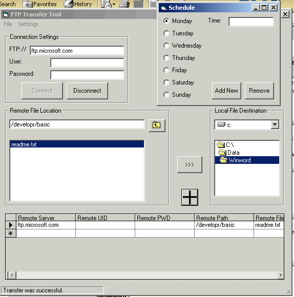



## FTPScheduler

### Description

The purpose of this application was to establish an application that could collect information from an ftp site on a scheduled basis.

The application collects Remote and Local file information from the user by requiring a valid connection to a site before addition to the Transfer List can be completed. Items that are saved in the Transfer List are prepared to be transfered according to the schedule that is established by the Scheduling form.

The application was designed to acquire files only. With a few modifications, it could be converted to place files on a server as well.

As stated previously it is purely an FTP application. With a few modifications, it could be converted to HTTP and Gopher as well.

The application consists of 2 applications really. One is the FTPConfig.exe, which is used to modify the .xml file that retains the file specific information onwhat has to be moved where. The other is the FTPAutoExec.exe, which is used by the Scheduler to perform the update behind the scenes.

The scheduling form successfully adds a job to the Scheduled Jobs for the local PC by way of the netapi32.dll, so this application can only be used on NT 3.5 and Win 2K machines. I found, that when executing the Scheduler on my Win 2K machine that the job would not execute as expected. I actually had to enter my NT username and password into the job Properties, before it would work correctly. Any suggestions on how to perform this programatically would be appreciated.
 
### More Info
 

             |
---                |---
**Submitted On**   |2002-04-09 12:44:18
**By**             |[Jeff Cote](https://github.com/Planet-Source-Code/PSCIndex/blob/master/ByAuthor/jeff-cote.md)
**Level**          |Advanced
**User Rating**    |4.4 (35 globes from 8 users)
**Compatibility**  |VB 5\.0, VB 6\.0
**Category**       |[Complete Applications](https://github.com/Planet-Source-Code/PSCIndex/blob/master/ByCategory/complete-applications__1-27.md)
**World**          |[Visual Basic](https://github.com/Planet-Source-Code/PSCIndex/blob/master/ByWorld/visual-basic.md)
**Archive File**   |[FTPSchedul70417492002\.zip](https://github.com/Planet-Source-Code/jeff-cote-ftpscheduler__1-33631/archive/master.zip)

